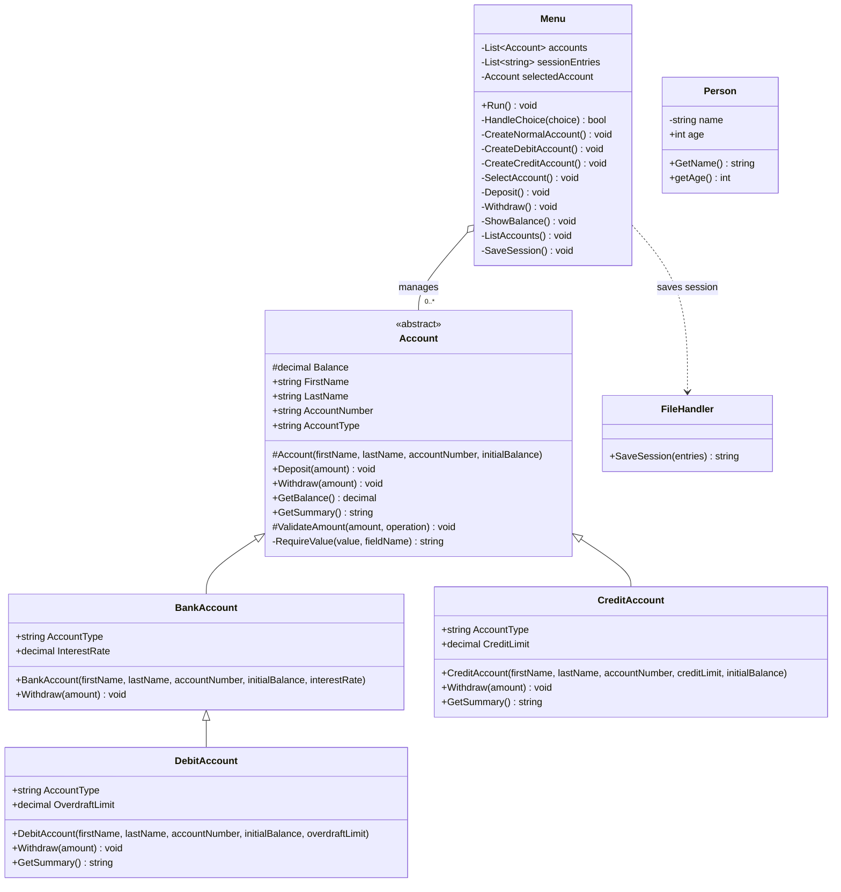

# Bank Account UML Diagram

The diagram below shows the current classes, inheritance, access levels, and the main relationships in the application.

## Relationship notes

- `Account` is abstract, so the menu creates concrete account types instead of creating an `Account` directly.
- `BankAccount` is the normal account and does not allow withdrawals below zero.
- `DebitAccount` inherits normal account behavior and adds an overdraft limit.
- `CreditAccount` allows a negative balance up to its credit limit.
- `Menu` stores zero or more accounts and keeps track of the selected account.
- `FileHandler` is used by `Menu` to save the current session as a text file.
- `Person` currently exists separately and is not used by the account workflow.
